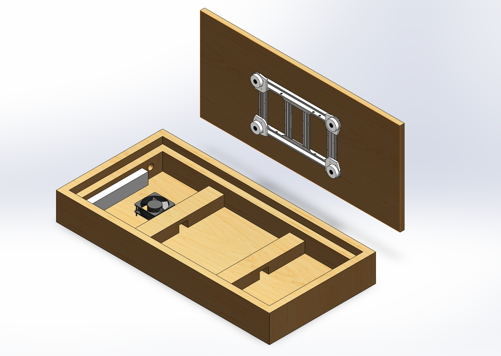
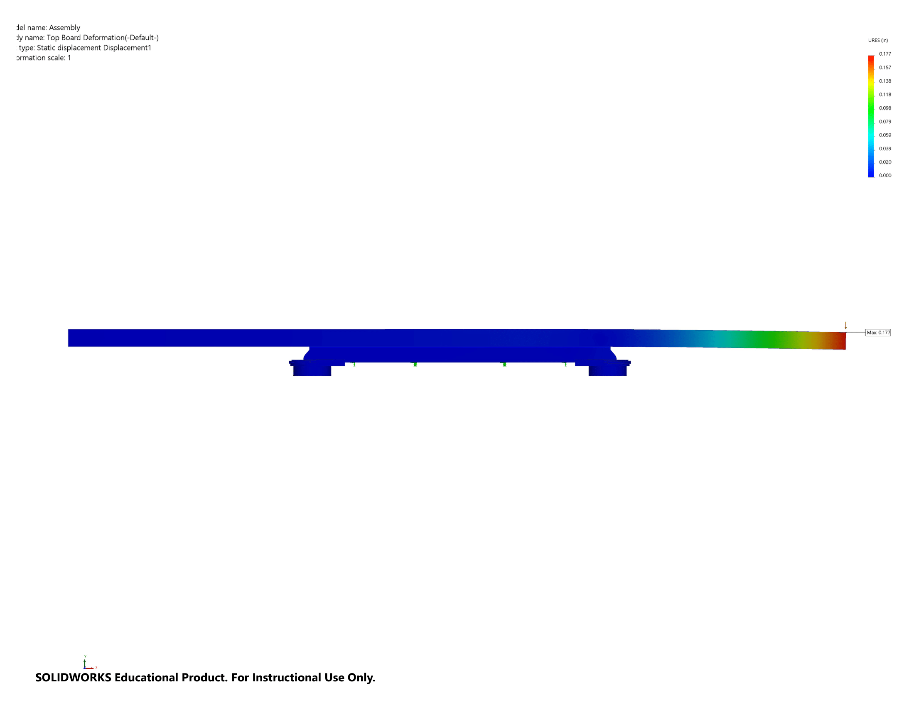
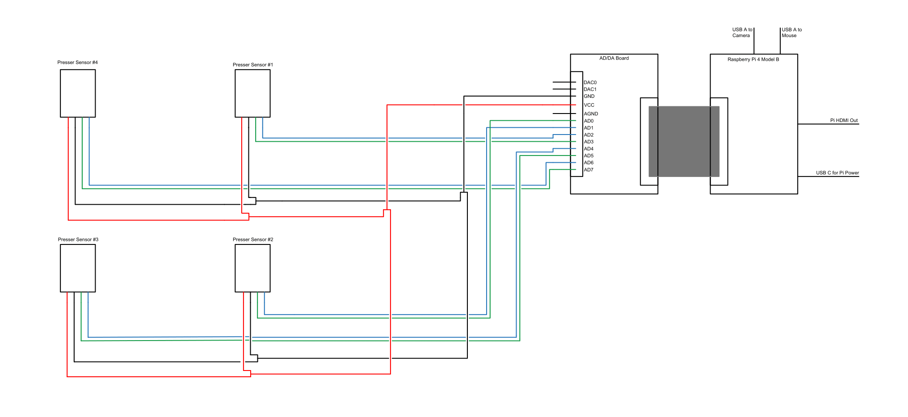
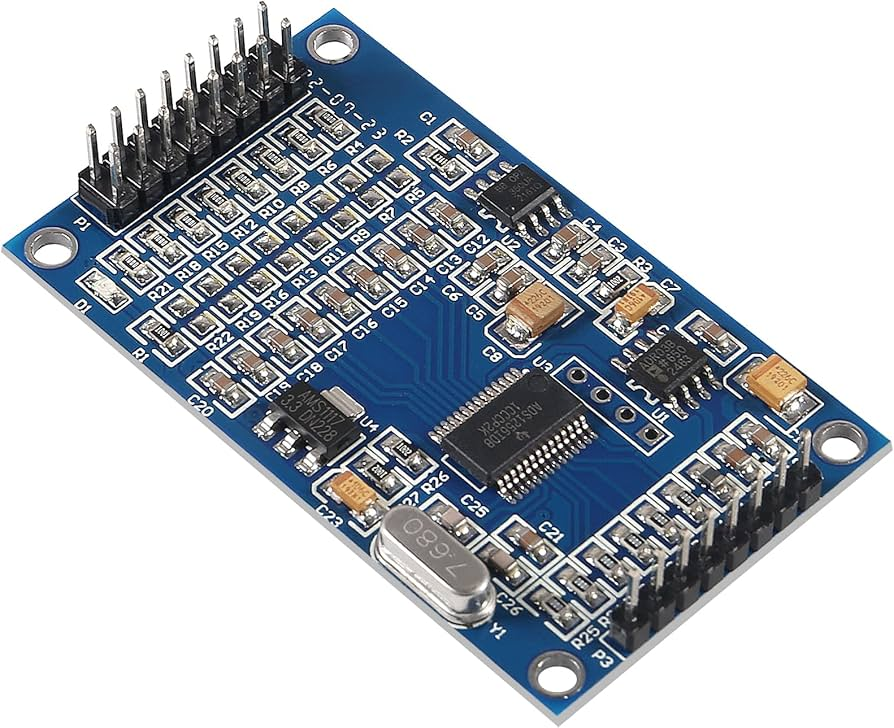

# Dynamic Golf Board — Load Cell System

This directory contains all necessary files to operate the **Dynamic Golf Board**, designed to track and measure a golfer's center of mass during their swing.

## Overview

The Dynamic Golf Board uses 4 load cells, sourced from a Wii Balance Board, to measure weight distribution during a golf swing. The load cells are wired to a Raspberry Pi equipped with an AD/DA Expansion board for high-precision analog-to-digital conversion. The load cells output differential voltage values, which are converted to weight through a calibration process. The source code within this directory is deployed to the embedded Raspberry Pi.

All CAD files for the Dynamic Golf Board can be found in the **/references** directory along with other documentation. A bending analysis was also conducted as shown below:





## How to Use

1. **Hardware Setup**:
    - Connect the 4 load cells to the Raspberry Pi via the AD/DA Expansion board.
    - Ensure proper wiring as per the schematic below.
  
2. **Calibration**:
    - Use the command below to run a script to calibrate each load cell individually. This will establish the calibration factors for accurate weight readings.

    ```bash
    python main.py calibrate
    ```

3. **HDMI Output**
    - Use the Raspberry Pi's HDMI port to connect to a tablet/screen to view output.

4. **Running the Program**:
    - Run the main program to start reading weight values from each load cell.
    - The system will record the weights during the swing, and center of mass calculations will be performed.

    ```bash
    python main.py
    ```

## Wiring Schematic



- **Load Cells**: Wired to the AD/DA Expansion board.
- **Raspberry Pi**: Connected to the AD/DA Expansion board, which handles the analog-to-digital conversion for precise load cell readings.

Ensure all connections follow the wiring diagram for proper functionality.

## AD/DA Expansion Board: ADS1256
The ADS1256 is a high-precision 24-bit analog-to-digital converter (ADC) module that enables the Raspberry Pi to interface with analog sensors. In this project, the ADS1256 is used to connect load cells to the Raspberry Pi, allowing for accurate measurement of weight or force. The module's high resolution and built-in programmable gain amplifier make it ideal for reading the small voltage changes produced by load cells. This extends the Raspberry Pi's capabilities, which lacks native support for analog signal processing.



---